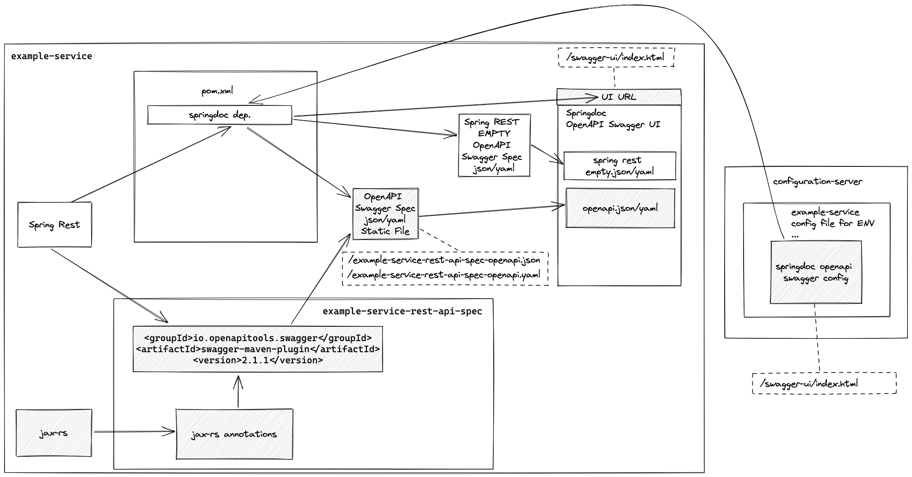
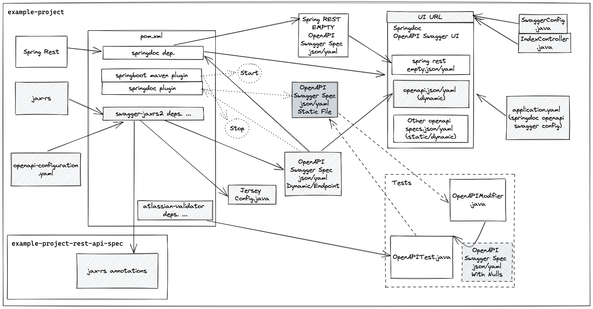
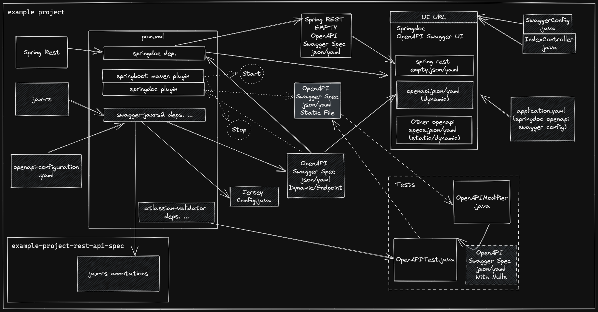

# README

---

**Please note that this is an example knowledge base repository.**

**It is intended to show a working SpringBoot + JAX-RS + Springdoc example of code-to-spec generation from an existing codebase.**

**It also has some basic information about spec-to-code generation.**

---

## Simpler solution for only generating v3 OpenAPI Swagger specs - minimalistic approach




---

## More complex solution with more features

## Files and Directories

- ***springdoc-example*** - SpringBoot + JAX-RS + Springdoc working example (code-to-spec generation)


- *experimental-branches-v2* - branches of example-property-project with different approaches tried with springdoc and springfox.
They were for research and development purposes, so they are not fully working.


- *openapi-swagger-springboot-jax-rs-springdoc-excalidraw-diagrams* - diagrams


- [other-files/openapi-swagger-spec-springboot-jax-rs-rnd-bkmrks.md](other-files/openapi-swagger-spec-springboot-jax-rs-rnd-bkmrks.md) - Bookmarks of research and encountered problems.

---

## OpenAPI Swagger code-to-spec generation

### Springdoc working example files of interest

- `/src/main/resources/static/swagger-openapi-specs/example-property-dir-inbound/example-property-project-inbound-openapi-swagger-spec.json`
  - Generated static OpenAPI Swagger spec file of the inbound (to our service) API calls our clients can make in JSON.


- `/src/main/resources/static/swagger-openapi-specs/example-property-dir-inbound/example-property-project-inbound-openapi-swagger-spec.yaml`
  - Generated static OpenAPI Swagger spec file of the inbound (to our service) API calls our clients can make in YAML.


- `/src/main/resources/static/swagger-openapi-specs/example-property-dir-outbound/KL_Gis.ws.inbound.geodata.v1.json`
  - OpenAPI Swagger spec file given to us by an external team of the outbound (to our service) API calls our service can make to their service in JSON.


- `/src/main/resources/static/swagger-openapi-specs/example-property-dir-outbound/KL_Gis.ws.inbound.geodata.v1.yaml`
    - OpenAPI Swagger spec file given to us by an external team of the outbound (to our service) API calls our service can make to their service in YAML.


- `example-property-project/pom.xml`
  - Necessary dependencies and plugins added.


- `/src/main/resources/application.yml`
  - Springdoc dependency configuration.


- `/src/main/resources/openapi-configuration.yaml`
  - Configuration which influances the generation of an OpenAPI Swagger spec file from our existing codebase.
  In this case it is used to add some information which was missing from the generated OpenAPI Swagger spec file,
  which is necessary to make it valid, for example the "info" and "servers" sections.


- `/src/main/java/com/example/property/project/config/JerseyConfig.java`
  - Registering OpenApi resources for generation of OpenApi swagger spec here.


- `/src/main/java/com/example/property/project/config/SwaggerConfig.java`
    - Some configuration for re-directing to the swagger ui.


- `/src/main/java/com/example/property/project/controller/IndexController.java`
    - A controller for re-directing to the swagger ui by default.


- `/src/test/java/com/example/property/project/service/geocoder/InboundSwaggerOpenApiTestIT.java`
  - This test uses Atlassian's OpenApiValidationFilter to validate our code against our OpenAPI Swagger spec file,
  which is describing our APIs. It is using a custom OpenAPIModifer.class to modify our OpenAPI Swagger spec file
  before it runs the tests. This is so, because the OpenAPI validator will check for all possible components and
  properties and fail if any one  of them is null or missing. This would mean we have to mock basically everything
  which is not feasible. So, instead OpenAPIModifer.class adds the "nullable" property to our OpenAPI spec, so that
  we can test only for the paths, components, schemas etc. which we are currently interested in in any given test.


- `/src/test/java/com/example/property/project/OpenAPIModifier.java`
  - This is a custom OpenAPIModifer.class to modify our OpenAPI Swagger spec file before the tests run.
  This is so, because Atlassian's OpenAPI validator will check for all possible components and properties and fail
  if any one of them is null or missing. This would mean we have to mock basically everything which is not feasible.
  So, instead OpenAPIModifer.class adds the "nullable" property to our OpenAPI spec, so that we can test only for
  the paths, components, schemas etc. which we are currently interested in, in any given test.
  
---

### Springdoc working example high level diagram





---

## OpenAPI Swagger spec-to-code generation

### OpenAPI-Generator CLI commands

- Command for generating only Java APIs code from a provided OpenAPI Swagger spec file in either JSON or YAML.

```shell
openapi-generator generate --global-property apis -i openapi.json -g spring -o generate-apisonly/
```

- Command for generating a full Java SpringBoot codebase from a provided OpenAPI Swagger spec file in either JSON or YAML.

```shell
openapi-generator generate -i openapi.json -g spring -o generate-full/
```

### Other OpenAPI-Generator CLI commands

- Command for validating an OpenAPI Swagger spec file in either JSON or YAML.

```shell
openapi-generator validate -i ./src/main/resources/static/swagger-openapi-specs/example-property-dir-inbound/example-property-project-inbound-openapi-swagger-spec.json
```

---

## Links

<https://excalidraw.com/>

---
